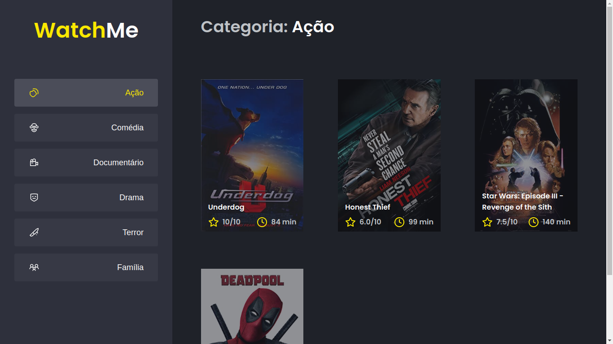

<h1 align="center">WatchMe</h1>



> Site de catálogo de filmes.

## :page_facing_up: Explicação

O desafio consistia em componentizar a aplicação e utilizar o conceito de elevação de estado no  reactjs. E integrar com uma fake api com o json server.

## ⚔️ Desafio

:heavy_check_mark: Componentização da aplicação\
:heavy_check_mark: Utilização do conceito de elevação de estado

## 🚀 Tecnologias ##

- [ReactJS](https://pt-br.reactjs.org/)
- [React Hooks](https://pt-br.reactjs.org/docs/hooks-intro.html)
- [TypeScript](https://www.typescriptlang.org/)
- [Axios](https://axios-http.com/ptbr/docs/intro)

## :closed_book: Como usar? ##

Antes de iniciar, você precisa ter [Git](https://git-scm.com) e [Node](https://nodejs.org/en/) instalados.

```bash
# Clone this project
$ git clone https://github.com/antonio-ma-santos/ignite-challenge-02.git
# Access
$ cd ignite-challenge
# Install dependencies
$ yarn or npm 
# Run the project
$ yarn dev or npm dev
# The server will initialize in the <http://localhost:8080>
#Run server json
$ yarn server or npm server
```

## 🤝 Colaboradores

Agradecemos às seguintes pessoas que contribuíram para o projeto:

<table>
  <tr>
    <td align="center">
      <a href="#">
        <br>
        <sub>
          <b>Antônio Marcelino</b>
        </sub>
      </a>
    </td>
  </tr>
</table>

&#xa0;

<a href="#top">Voltar para o topo</a>
